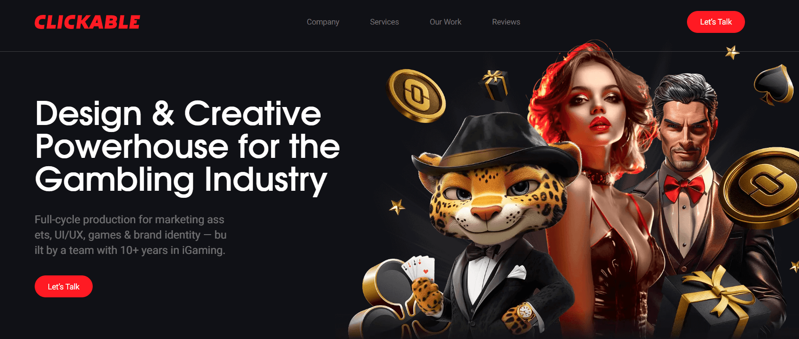

# Gambling Creative Website

A high-converting landing page for a creative agency operating in the gambling industry. Built with performance, visual appeal, and user interaction in mind.

**Demo**: [Open demo][live-demo]



## Technologies Used

- [Next.js 14](https://nextjs.org/docs/getting-started)
- [HeroUI v2](https://heroui.com/)
- [Tailwind CSS](https://tailwindcss.com/)
- [TypeScript](https://www.typescriptlang.org/)
- [Framer Motion](https://www.framer.com/motion/)

The "Let’s Talk" or "Book a Call" buttons open a modal with a form. On submit, it sends a POST request to next.js route and uses Nodemailer to email submissions.

### Features

- Responsive landing page layout
- Scroll-based animations
- Reusable modal & form components
- Email sending via Nodemailer (API Route)

### Getting Started

1. **Clone the repository:**

   ```bash
   git clone https://github.com/AslanovRustam/gambling.git

   cd gambling

   npm i

   npm run dev
   ```

   Open http://localhost:3000 in your browser to see the result.

   [live-demo]: https://gambling-six.vercel.app/
